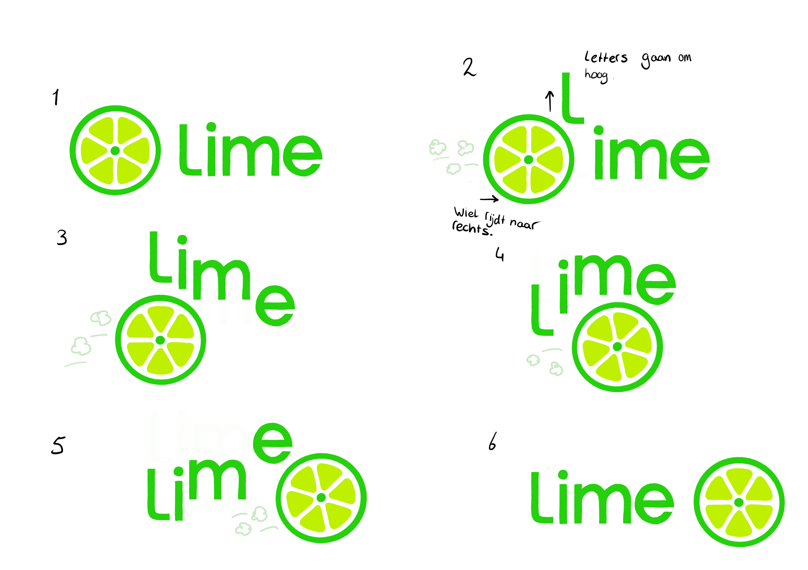

# Procesverslag
**Auteur:** -Stephanie de Vilder-

**De opdrachten:** [opdracht 1](opdracht1/index.html) en [opdracht 2](opdracht2/index.html)

Markdown is een simpele manier om HTML te schrijven.  
Markdown cheat cheet: [Hulp bij het schrijven van Markdown](https://github.com/adam-p/markdown-here/wiki/Markdown-Cheatsheet).

Nb. De standaardstructuur en de spartaanse opmaak van de README.md zijn helemaal prima. Het gaat om de inhoud van je procesverslag. Besteedt de tijd voor pracht en praal aan je website.

Nb. Door *open* toe te voegen aan een *details* element kun je deze standaard open zetten. Fijn om dat steeds voor de relevante stuk(ken) te doen.

## Bronnenlijst
  1. https://codepen.io/qrac/pen/MRPJLB
  2. https://stackoverflow.com/questions/20790305/how-to-make-the-last-keyframe-of-your-animation-stay-after-animation-is-finish
  3. https://developer.mozilla.org/en-US/docs/Web/CSS/gradient/linear-gradient
  4. https://css-tricks.com/snippets/css/a-guide-to-flexbox/

## Opdracht 1 plan

  
Ik wil met het logo van 'Lime' een animatie gaan maken. Dit logo heeft een limoen in het logo wat op een wiel lijkt. Lime is een bedrijf die electrische stepjes aanbied in bepaalde steden. Hierdoor wil ik het limoentje in mijn animatie laten rollen als een wiel, waarbij de letters ervoor uitwijken. 

  ### Je storyboard:
  

  ### Je ambitie: 
  Aan deze technieken/punten wil ik werken:
  - Responsiveness
  - Light dark mode
  - Verzorgde code

## Opdracht 1 reflectie

  
uitwerken bij afronden opdracht (voor week 3)

  ### Je uitkomst - karakteristiek screenshot(s):
  

  ### Dit ging goed/Heb ik geleerd: 
  Ik heb geleerd dat het helemaal niet zo ingewikkeld hoeft te zijn om je werk responsive te maken. Aan het begin was ik heel moeilijk aan het denken en ging ik de elementen kleiner maken vanaf een bepaalde view width. Nu weet ik dat je met het gebruik van "vw" heel makkelijk je element kan schalen ten opzichte van je scherm grootte. Ook heb ik meer geleerd over flexbox en hoe je hiermee makkelijk elementen kan plaatsen, ook ten opzichte van elkaar.
  Dit is eigenlijk basis css kennis die ik blijkbaar nooit goed onder de knie had. Het is dus heel fijn om nu dit te weten als basis voor mijn volgende projecten.

  Iets wat ik ook heb geleerd en iets lastiger waar ik zelf niet op was gekomen was het plaatsen van verschillende lagen over elkaar. Ik had het wiel eerst gemaakt door middel van list items. Alle partjes van de limoen waren dus allemaal losse elementen. Nu heb ik dit gemaakt door verschillende kleuren op elkaar te leggen en voor de partjes linear gradients te gebruiken om lijnen te maken.
  Zie afbeelding

  Ook wilde ik graag als finishing touch de limoen op het eind laten staan waar de animatie stopte en niet dat hij terug sprong naar het begin. Dit is gelukt door "animation-fill-mode" te gebruiken.

  

  ### Dit was lastig/Is niet gelukt:
  Als ik 

  

## Opdracht 2 plan

  
uitwerken na schetsen idee (voor week 4)

  ### Je ontwerp:
  

  ### Je ambitie: 
  Aan deze technieken/punten wil ik werken:
  - punt 1
  - punt 2
  - nog een punt
  - ...

## Opdracht 2 test

  
uitwerken na testen (week 6/7)

  Neem minimaal 5 bevindingen op:

  ### Bevinding 1:
  Omschrijving van wat er nog niet orde was (tekst en afbeeding(en)).

  #### oplossing:
  Beschrijving hoe je het hebt hebt opgelost of als het niet gelukt is hoe je het zou oplossen (tekst en afbeeding(en)).

  ### Bevinding 2:
  Omschrijving van wat er nog niet orde was (tekst en afbeeding(en)).

  #### oplossing:
  Beschrijving hoe je het hebt hebt opgelost of als het niet gelukt is hoe je het zou oplossen (tekst en afbeeding(en)).

  ### Bevinding 3:
  ...

## Opdracht 2 reflectie

  
uitwerken bij afronden opdracht (voor week 8)

  ### Je uitkomst - karakteristiek screenshot(s):
  

  ### Dit ging goed/Heb ik geleerd: 
  Korte omschrijving met plaatje(s)

  

  ### Dit was lastig/Is niet gelukt:
  Korte omschrijving met plaatje(s)

  

