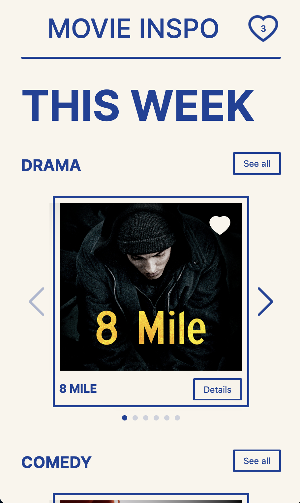
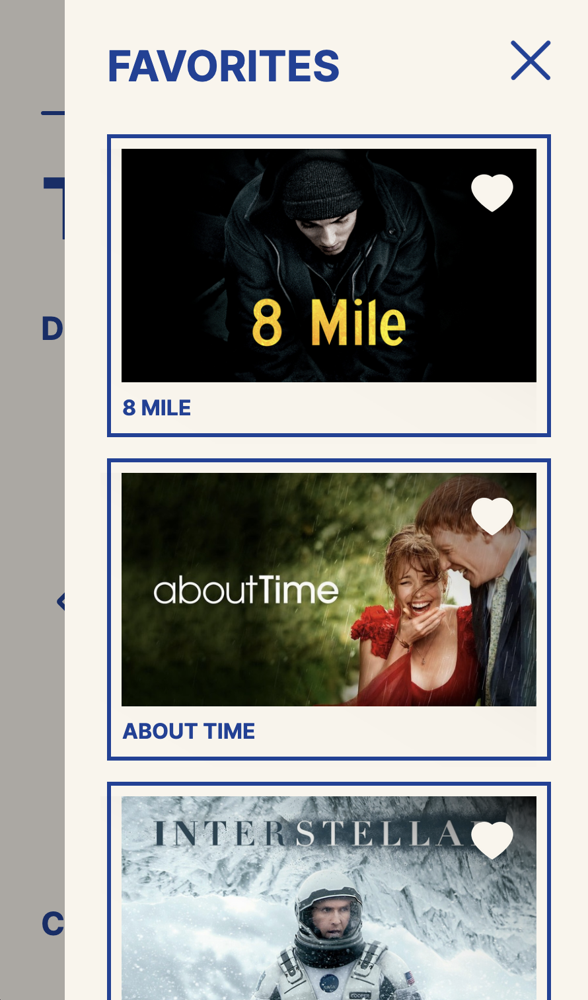

# Procesverslag
**Auteur:** -Stephanie de Vilder-

**De opdrachten:** [opdracht 1](opdracht1/index.html) en [opdracht 2](opdracht2/index.html)

Markdown is een simpele manier om HTML te schrijven.  
Markdown cheat cheet: [Hulp bij het schrijven van Markdown](https://github.com/adam-p/markdown-here/wiki/Markdown-Cheatsheet).

Nb. De standaardstructuur en de spartaanse opmaak van de README.md zijn helemaal prima. Het gaat om de inhoud van je procesverslag. Besteedt de tijd voor pracht en praal aan je website.

Nb. Door *open* toe te voegen aan een *details* element kun je deze standaard open zetten. Fijn om dat steeds voor de relevante stuk(ken) te doen.

## Bronnenlijst
  1. https://codepen.io/qrac/pen/MRPJLB
  2. https://stackoverflow.com/questions/20790305/how-to-make-the-last-keyframe-of-your-animation-stay-after-animation-is-finish
  3. https://developer.mozilla.org/en-US/docs/Web/CSS/gradient/linear-gradient
  4. https://css-tricks.com/snippets/css/a-guide-to-flexbox/

  5. https://www.google.com/search?client=firefox-b-d&q=swiper+hover+effect#fpstate=ive&ip=1&vld=cid:ce6de743,vid:PMVJnZa87zg,st:0
  6. https://www.youtube.com/watch?v=ywtkJkxJsdg
  7. https://codesandbox.io/p/sandbox/7q4thl?file=%2Findex.html%3A42%2C5-47%2C6
  8. https://swiperjs.com/demos
  9. https://codepen.io/thrgsmypny/pen/WNjJPGG
  10. https://www.freecodecamp.org/news/if-statements-javascript/
  11. https://developer.mozilla.org/en-US/docs/Web/CSS/::backdrop
  12. https://developer.mozilla.org/en-US/docs/Web/CSS/CSS_images/Using_CSS_gradients
  13. https://css-tricks.com/snippets/css/complete-guide-grid/
  14. https://dev.to/ziratsu/switch-to-a-darker-image-when-on-dark-mode-2lkh
  15. https://developer.mozilla.org/en-US/docs/Web/HTML/Element/dialog
  16. https://dev.to/mayashavin/making-dialog-with-html-dialog-element-1lpp 

Film bronnen:
  1. https://www.disneyplus.com/nl-nl/movies/the-devil-wears-prada/kaiaozWbNugM
  2. https://www.rottentomatoes.com/m/about_time
  3. https://www.tvinsider.com/show/the-pianist/
  4. https://www.tvinsider.com/show/interstellar/ 
  5. https://hoyeeh.com/movies/details/the-talented-mr-ripley/2221
  6. https://facts.net/movie/38-facts-about-the-movie-call-me-by-your-name/
  7. https://www.netflix.com/title/60020322
  8. https://www.rottentomatoes.com/m/knives_out
  9. https://www.rottentomatoes.com/m/bridesmaids_2011
  10. https://www.primevideo.com/detail/Superbad/0OFJ3NFXUM8K9RXOUC59GF4ZVT
  11. https://facts.net/movie/43-facts-about-the-movie-meet-the-parents/
  12. https://www.imdb.com/title/tt0298203/
  13. https://en.wikipedia.org/wiki/The_Devil_Wears_Prada_(novel)
  14. https://en.wikipedia.org/wiki/Knives_Out
  15. https://www.imdb.com/title/tt1478338/
  16. https://en.wikipedia.org/wiki/Meet_the_Parents
  17. https://www.rottentomatoes.com/m/superbad

## Opdracht 1 plan

  
Ik wil met het logo van 'Lime' een animatie gaan maken. Dit logo heeft een limoen in het logo wat op een wiel lijkt. Lime is een bedrijf die electrische stepjes aanbied in bepaalde steden. Hierdoor wil ik het limoentje in mijn animatie laten rollen als een wiel, waarbij de letters ervoor uitwijken. 

  ### Je storyboard:
  

  ### Je ambitie: 
  Aan deze technieken/punten wil ik werken:
  - Responsiveness
  - Light dark mode
  - Verzorgde code

## Opdracht 1 reflectie

  
uitwerken bij afronden opdracht (voor week 3)

  ### Je uitkomst - karakteristiek screenshot(s):
  

  ### Dit ging goed/Heb ik geleerd: 
  Ik heb geleerd dat het helemaal niet zo ingewikkeld hoeft te zijn om je werk responsive te maken. Aan het begin was ik heel moeilijk aan het denken en ging ik de elementen kleiner maken vanaf een bepaalde view width. Nu weet ik dat je met het gebruik van "vw" heel makkelijk je element kan schalen ten opzichte van je scherm grootte. Ook heb ik meer geleerd over flexbox en hoe je hiermee makkelijk elementen kan plaatsen, ook ten opzichte van elkaar.
  Dit is eigenlijk basis css kennis die ik blijkbaar nooit goed onder de knie had. Het is dus heel fijn om nu dit te weten als basis voor mijn volgende projecten.

  Iets wat ik ook heb geleerd en iets lastiger waar ik zelf niet op was gekomen was het plaatsen van verschillende lagen over elkaar. Ik had het wiel eerst gemaakt door middel van list items. Alle partjes van de limoen waren dus allemaal losse elementen. Nu heb ik dit gemaakt door verschillende kleuren op elkaar te leggen en voor de partjes linear gradients te gebruiken om lijnen te maken.
  Zie afbeelding

  Ook wilde ik graag als finishing touch de limoen op het eind laten staan waar de animatie stopte en niet dat hij terug sprong naar het begin. Dit is gelukt door "animation-fill-mode" te gebruiken.

  

  ### Dit was lastig/Is niet gelukt:
  

  

## Opdracht 2 plan

  
Mijn ontwerp is een website waar je door een reeks films kan bladeren doormddel van een carrousel lijst. Je kan op de film klikken wat een pop up opent, waar meer informatie te vinden is. Daarnaast kan je de films als favoriet markeren waardoor ze naar een lijst gestuurd worden waar je alle favorieten films kan terug vinden.

  ### Je ontwerp:
  

  ### Ontwerp versie 2:
  

  In de loop van de eerste weken heb ik het design wat aangepast. Zo heb ik bijvoorbeeld, inplaats van een aparte pagina voor de favorieten lijst, de favorieten lijst in een slide in menu geplaatst. Het ontwerp moet een "onepage" zijn waardoor dit beter aansluit. Ook is het erg efficient en toegangelijk voor de gebruiker.

  ### Je ambitie: 
  Aan deze technieken/punten wil ik werken:
  - Basic javascript begrijpen en als iets niet werkt, kunnen analyseren waarom dat dan is.
  - Responsiveness
  - Positionering van elementen zoals met flexbox en grid etc.
  - werken met verschillende states

## Opdracht 2 test

  
uitwerken na testen (week 6/7)

  Neem minimaal 5 bevindingen op:

  ### Bevinding 1:
  FOCUS STATE

  #### oplossing:
  Tijdens mijn assesibilty test kwam ik er al snel achter dat ik was de focus state was vergeten te stijlen. Je kreeg dus de default focus state te zien en deze paste niet mooi bij mijn ontwerp en viel niet goed op omdat mijn meest gebruikte kleu al blauw is (zie afb 01). Ik heb alle buttons en linkjes een custom focus state gegeven, met als overeenkomende kleur: 0ranje. Oranje valt erg op en heeft een goed contrast met blauw en de zandkleur. Ook is het een persoonlijke stijl keuze omdat ik blauw en orangje een mooie combinatie vind.

  
  

  ### Bevinding 2:
  LABELS

  #### oplossing:
  Ik heb een test gedaan met een screenreader. Ik zag al in de inspector accesability (zie afb 03) dat er veel errors waren en ik bijna nergens een label had gemaakt voor buttons etc. Dus toen ik met een screedreader door de website heen ging werd dit al duidelijk. De buttons zonder text veld werden opgenoemd als knop 6 bijvoorbeeld. 
  Ik heb dit opgelost door aria-labels toe te voegen en een alt text toe te voegen aan images.

  
  

  Oplossing:

  
  

  ### Bevinding 3:
  DETAILS BUTTON NOT SHOWING

  #### oplossing:
  Tijdens het testen van mijn focus state en het navigeren via de toetsenbord kwam ik erachter dat je details button niet kan zien wanneer je navigeert met je toetsenbord en je er op staat met de focus state. Dit komt omdat de button op een hover element zit.
  De button word wel gelezen door een screenreader en op mobile heb je er geen last van omdat daar de buttons altijd zichtbaar zijn.

  Ik heb dit probleem proberen op te lossen (zie afb 08) maar dit is helaas nog niet gelukt. 

  
  
  

  ### Bevinding 4:
  PROVIDE A NATURAL NEXT STEP 

  #### oplossing:
  Tijdens mijn test vond ik dat de interface design principle "provide a natural next step", bij de favorieten lijst nog niet helemaal compleet was. Ik kreeg daarom het plan om een button toe te voegen aan de lege lijst waarbij je naar een film overzicht zou worden gestuurd. Zo kan iemand die misschien vast loopt weer door. Het lukte me om een button te maken en hem te plaatsen maar nog niet om hem weg te halen wanneer er wel elementen in de lijst zitten. Omdat deze fuctie dus nog niet helemaal goed werkte heb ik hem uiteindelijk eruit gehaald om het wat cleaner te houden.

  

  ### Bevinding 5:
  FAVORIETEN LIJST NOT READ

  #### oplossing:
  Het laatste probleem waar ik tijdens mijn test achter kwam was dat de films in de favorieten lijst niet goed werken ten opzichten van accesabilty. De film elementen worden niet opgelezen tijdens een screenreader en je kan niet navigeren door de films heen waardoor je ze dus ook niet uit de lijst kan halen via deze favorieten lijst. 
  Op het eerste oog is dit dus niet een heel groot probleem omdat het voor de meeste mensen geen probleem is. Maar als ik een goede werkende website wil bouwen voor alle gebruikers zou dit iets zijn waar ik een oplossing voor zou moeten verzinnen.

  

## Opdracht 2 reflectie

  
uitwerken bij afronden opdracht (voor week 8)

  ### Je uitkomst - karakteristiek screenshot(s):
  Desktop:

  
  
  
  
  

  Mobile:

  
  

  ### Dit ging goed/Heb ik geleerd: 
  Uiteindelijk zijn er veel dingen die goed gingen. Ik heb een verzorgde werkende webpagina gemaakt die voldoet aan design principes en 
  Ik had nooit gedacht dat ik zo ver zou komen met javascript en het ook echt zou begrijpen. Daarom ben ik best trots op mijn eindproduct. 

  Wat goed ging/waar ik trots op ben is het toevoegen van de films aan de favorieten lijst. Sanne heeft me hier een opzetje voor laten zien in code pen maar ik heb het later zelf toegepast aan mijn ontwerp en het goed kunnen begrijpen waardoor ik toevoegingen heb kunnen doen. Het was namelijk nog niet helemaal compleet (Wanneer je de film verwijderde uit de lijst VIA de lijst kon je hem daarna er niet meer toevoegen).
  Ook heb ik het nummer van het aantal items in de lijst aan het de lijst button helemaal zelf toegevoegd. Dat ging ook goed.

  Wat ook goed ging is het werken met Dialog. Het stijlen hiervan en het positioneren van de elmenten gingen goed maar ook de dialog toevoegen aan alle verschillende films, zonder elke keer nieuwe JS te schrijven, ging beter/sneller dan verwacht.

  Ook heb ik veel geleerd over positionering met flexbox en grid. Grid had ik nog nooit gebruikt maar nu weet ik het goed te kunnen gebruiken.

  Zie website voor alles wat goed ging!

  ### Dit was lastig/Is niet gelukt:
  Wat ik lastig vond en uiteindlijk na veel proberen niet is gelukt is de details popup ook te kunnen openen vanuit de favorieten lijst. Ik had van alles geprobeert maar het duurde te lang waardoor ik heb besloten deze functie voor nu weg te laten. Verder heb ik nog 3 dingen die niet gelukt waren (zie de laatste bevindingen bij de test).

  

